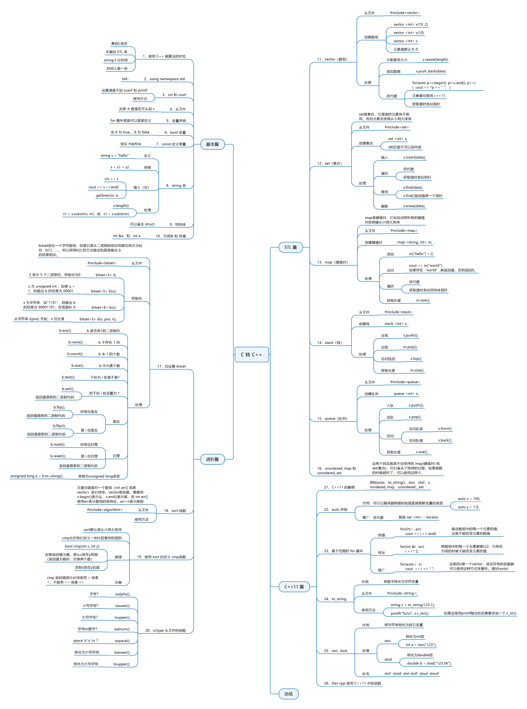

### 个人c++学习
  

***规范：不在头文件中使用 “using namespace xxx”，在引用过程中会引发意料之外的命名冲突
不使用<bit/stdc++.h>***
[c primer](tw.101isfj.ru/book/peoW5dNEeA/c-primer-中文版第-5-版.html)

#### c转c++部分

 
[c转c++基础](./c转c++/basic.cpp) 
[c转c++进阶](./c转c++/advanced.cpp) 
[c转c++的stl](./c转c++/stl.cpp) 
[c++11的特性](./c转c++/cpp11.cpp) 

#### 菜鸟c++

[类的一般知识](./菜鸟c++/class_learn.cpp)

[友元函数](./菜鸟c++/friend_fun.cpp)

[类的继承](./菜鸟c++/class_inhrit.cpp)

[重载](./菜鸟c++/overload.cpp)

[多态](./菜鸟c++/polymorphic.cpp)

[数据抽象](./菜鸟c++/Data_Abstract.md)

[数据封装](./菜鸟c++/Data_Encapsulation.md)

[文件和流](./菜鸟c++/file_stream.cpp)

[异常处理](./菜鸟c++/exception_handler.cpp)

[动态内存](./菜鸟c++/dynamic_mem.cpp)

[命名空间](./菜鸟c++/namespace.cpp)

[模板](./菜鸟c++/template.cpp)